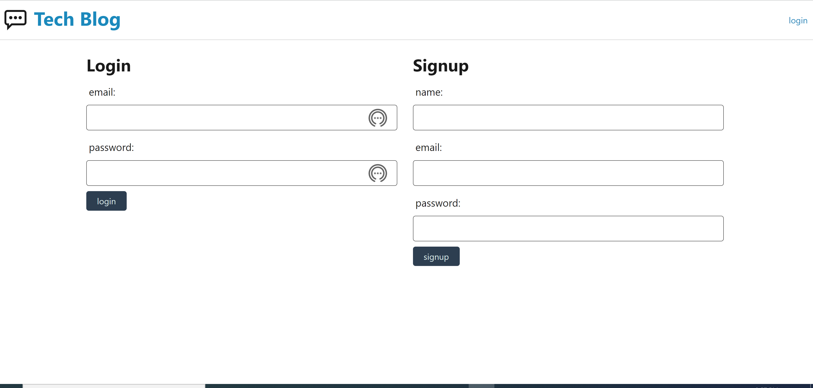
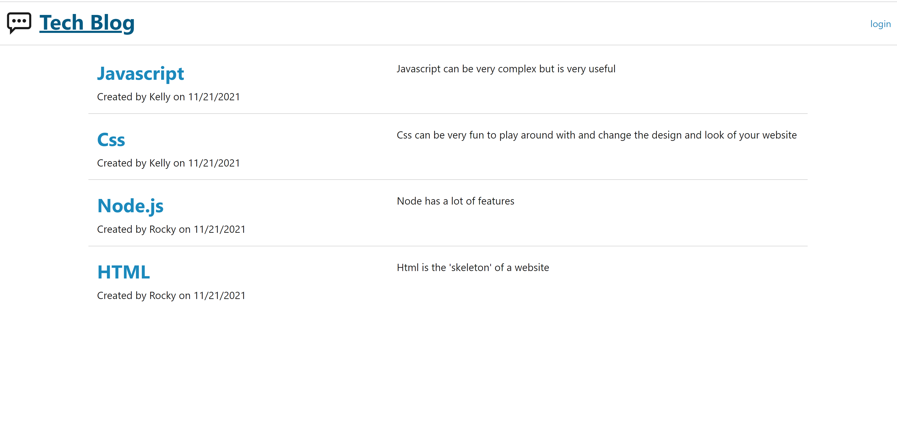
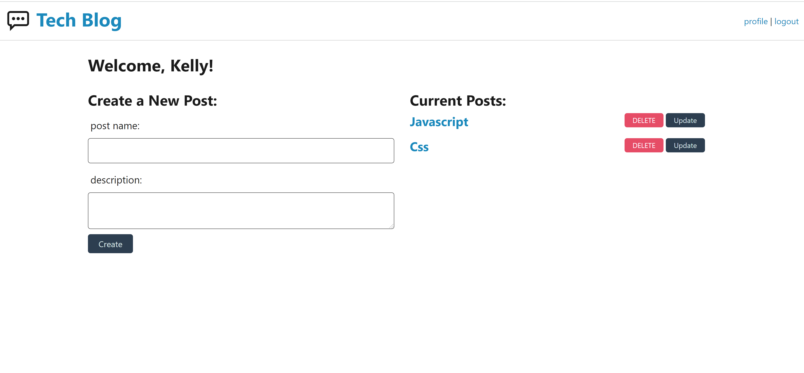
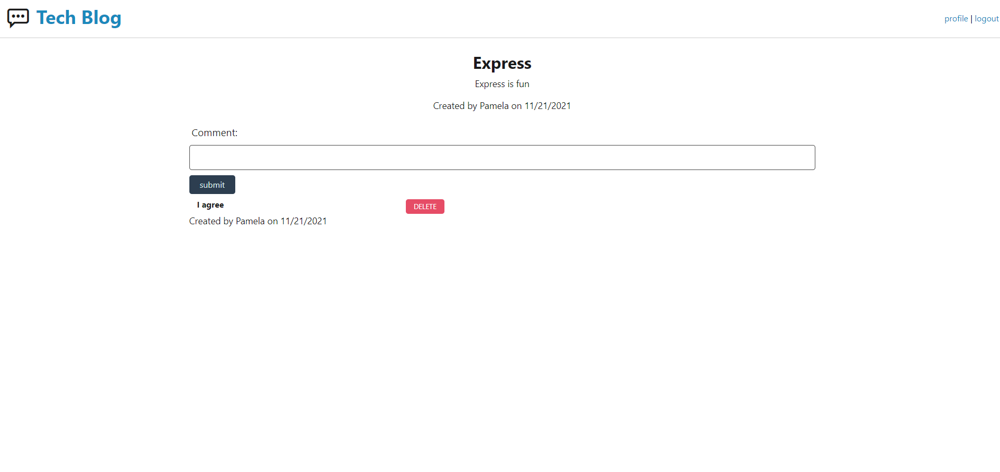

# Tech-Blog

## Description
This project is a tech blog website that uses Node.js, Express,MySQL, and Handlebars. It allows the users to create an account or login if they already have one. Once they are in their account they can create a new post and it will show up on the homepage and on their profile. Once they create a post anyone can add a comment on that post or delete a comment. The original writer of a post can also delete their own posts. I'm still working on the update post feature but soon to come a user should be able to edit or update an old post.

[walk through video](https://drive.google.com/file/d/1BgbAOqd91RaP9huDQCPMiBOUfQ1pT7fN/view)

## Usage
To get started log in to your account or sign up with your name, email, and password. Then you will be redirected to your profile page where you can create a new post. Once you create a post it will pop up on the profile page and the homepage. From there you should have the ability to delete any of the posts you create. You can also add comments to any of the posts by pressing the post you want and there will be a text box to add a comment. You can also delete any comment you want. If you are inactive for 15 minutes on the site it will log you for security purposes and then you will have to log back in if you wish to do anything else.

## Installation
To get started make sure to have node.js and MysQL installed on your computer. Clone the repositroy and then use the command 'npm install' to install all the dependecies. Log in to Mysql and enter the password. After source the schema by using the command 'source db/schema.sql'. Then you will exit Mysql and seed the data by running the command npm run seed and then start your server by typing the command 'node server.js'.

## License

[License: MIT](https://opensource.org/licenses/MIT)

Copyright (c) [2021] [Kelly R. Cano]

Permission is hereby granted, free of charge, to any person obtaining a copy
of this software and associated documentation files (the "Software"), to deal
in the Software without restriction, including without limitation the rights
to use, copy, modify, merge, publish, distribute, sublicense, and/or sell
copies of the Software, and to permit persons to whom the Software is
furnished to do so, subject to the following conditions:

The above copyright notice and this permission notice shall be included in all
copies or substantial portions of the Software.

THE SOFTWARE IS PROVIDED "AS IS", WITHOUT WARRANTY OF ANY KIND, EXPRESS OR
IMPLIED, INCLUDING BUT NOT LIMITED TO THE WARRANTIES OF MERCHANTABILITY,
FITNESS FOR A PARTICULAR PURPOSE AND NONINFRINGEMENT. IN NO EVENT SHALL THE
AUTHORS OR COPYRIGHT HOLDERS BE LIABLE FOR ANY CLAIM, DAMAGES OR OTHER
LIABILITY, WHETHER IN AN ACTION OF CONTRACT, TORT OR OTHERWISE, ARISING FROM,
OUT OF OR IN CONNECTION WITH THE SOFTWARE OR THE USE OR OTHER DEALINGS IN THE
SOFTWARE.
